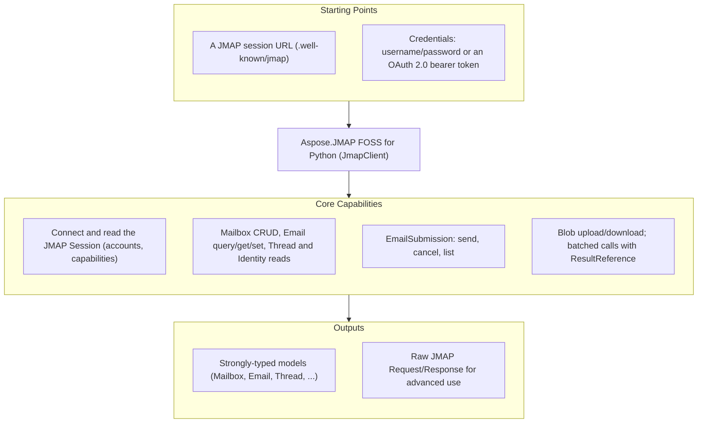

# Aspose.JMAP FOSS for Python

[](LICENSE) [](https://github.com/aspose-email-foss/Aspose.JMAP-FOSS-for-Python/graphs/contributors)

Aspose.JMAP FOSS for Python is a free, open source, pure-Python JMAP client library — a toolkit
for talking to a [JMAP](https://jmap.io) mail server over HTTP:
[RFC 8620](https://www.rfc-editor.org/rfc/rfc8620) Core (session, `Core/echo`, blob
upload/download, batched method calls) and [RFC 8621](https://www.rfc-editor.org/rfc/rfc8621)
Mail (Mailbox/Email/Thread/Identity/SearchSnippet) plus EmailSubmission. Its public API is
styled after Aspose.Email's client conventions — a client object plus an options object, a
`with` context-manager lifecycle, and strongly-typed message and folder models — and it ships
with no third-party dependencies (standard library only, `urllib` for transport).

**This is an official Aspose open-source project. It does not contain or reference Aspose.Email
proprietary source.** The library is generated from hand-authored JMAP protocol specifications.

## Navigation

- [At a Glance](#at-a-glance)
- [Key Capabilities](#key-capabilities)
- [Installation](#installation)
- [Dependencies](#dependencies)
- [Quick Start](#quick-start)
- [Additional Examples](#additional-examples)
- [API Reference](#api-reference)
- [Documentation & Resources](#documentation--resources)
- [Scope and Limitations](#scope-and-limitations)
- [Development and Testing](#development-and-testing)
- [License](#license)

## At a Glance



## Key Capabilities

- **Connect and inspect the session** — `client.connect()` fetches `/.well-known/jmap` and
  exposes the session (account ids, `capabilities`, `api_url`, `upload_url`, `download_url`).
- **Mailboxes** — `list_mailboxes()`, `get_mailbox()`, `create_mailbox()`, `delete_mailbox()`
  wrap `Mailbox/get`, `Mailbox/query`, and `Mailbox/set`.
- **Messages** — `list_messages()`, `fetch_message()`, `move_message()`,
  `set_message_keyword()`, `delete_message()` over `Email/query`, `Email/get`, and `Email/set`.
- **Identities** — `list_identities()` over `Identity/get`.
- **Sending** — `send()`, `cancel_send()`, `list_submissions()` wrap `EmailSubmission/set` and
  `EmailSubmission/get`.
- **Blobs** — `upload_blob()` / `download_blob()` for `/upload` and `/download`.
- **Batching** — `send_request()` sends any list of `Invocation`s in one HTTP round trip, with
  `ResultReference` ([RFC 8620 §3.7](https://www.rfc-editor.org/rfc/rfc8620#section-3.7)) to
  chain one call's result into the next.
- **Pluggable transport** — `JmapTransport` is an ABC; every unit test injects a
  `FakeJmapTransport`, so no test needs a network.
- **OAuth 2.0** — a `bearer_token` option ([RFC 6750](https://www.rfc-editor.org/rfc/rfc6750))
  as an alternative to HTTP Basic.

## Installation

No package has been published to PyPI yet; until it is, build the library from source (see
[Development and Testing](#development-and-testing)). The intended published id is
`aspose-jmap-foss`:

```bash
pip install aspose-jmap-foss
```

The package imports as `aspose_jmap_foss`, is pure Python source (no compiled extensions), and
targets Python 3.10 or later.

## Dependencies

### Required Package Dependencies

None. Transport uses `urllib.request` from the standard library; there are no runtime
dependencies in `pyproject.toml`.

### Native and System Requirements

- Python 3.10 or later. No compiled extensions and no native/system libraries.

### Development Dependencies

- `pytest` (the `[test]` extra) — the unit-test runner. Not required to use the library.

## Quick Start

```python
from aspose_jmap_foss import JmapClient, JmapClientOptions

options = JmapClientOptions(
    session_url="https://jmap.example.test/.well-known/jmap",
    username="user@example.test",
    password="secret",
)
with JmapClient(options) as client:
    client.connect()
    mailboxes = client.list_mailboxes()
```

## Additional Examples

### OAuth 2.0 bearer token authentication

Authenticate with an OAuth 2.0 bearer token
([RFC 6750](https://www.rfc-editor.org/rfc/rfc6750)) by passing `bearer_token`. When set, it
takes precedence over `username`/`password` and the client sends `Authorization: Bearer <token>`:

```python
options = JmapClientOptions(
    session_url="https://jmap.example.test/.well-known/jmap",
    username="",
    password="",
    bearer_token="eyJhbGciOi...",
)
```

<details>
<summary>Batching requests with ResultReference</summary>

Multiple method calls can be batched into a single HTTP round trip via `send_request()`, using a
`ResultReference` ([RFC 8620 §3.7](https://www.rfc-editor.org/rfc/rfc8620#section-3.7)) to chain
a later call to an earlier one's result without a second request:

```python
from aspose_jmap_foss import Invocation, ResultReference

query = Invocation(name="Email/query", arguments={"accountId": account_id}, method_call_id="c1")
get = Invocation(
    name="Email/get",
    arguments={
        "accountId": account_id,
        "#ids": ResultReference(result_of="c1", name="Email/query", path="/ids").to_json(),
    },
    method_call_id="c2",
)
resp = client.send_request([query, get], using=["urn:ietf:params:jmap:mail"])
```

</details>

## API Reference

`JmapClient` (with `JmapClientOptions`) is the single entry point; the model classes
`Session`, `Mailbox`, `Email`, `EmailAddress`, `Thread`, `Identity`, `EmailSubmission`, and
`SearchSnippet` mirror the JMAP objects one-to-one, and `Invocation` / `ResultReference` model
raw method calls for `send_request()`. Errors surface as `JmapNetworkError` (transport) and
`JmapProtocolError` (a JMAP method-level error); per-item `Set` failures are returned as data on
the result object rather than raised.

The protocol/API reference is generated from the same specifications that drive this library.

## Documentation & Resources

- Found a bug or have a feature request? [Open an issue](https://github.com/aspose-email-foss/Aspose.JMAP-FOSS-for-Python/issues) on GitHub.

## Scope and Limitations

- **Protocol**: JMAP Core (RFC 8620) and JMAP Mail (RFC 8621: Mailbox/Email/Thread/Identity/SearchSnippet)
  plus EmailSubmission.
- **Out of scope for v1**:
  - Push / `EventSource` streaming — the type exists but is a stub/no-op.
  - JMAP for Calendars and Contacts.
  - `Date`/`UTCDate` values are kept as raw RFC 3339 strings (no `datetime` parsing) to avoid
    timezone-conversion bugs.
- Unit tests run against a `FakeJmapTransport` with mocked responses — no live JMAP server is
  required. A Docker-based live-server integration suite (Stalwart Mail Server) lives in
  a separate Docker-based live-server suite used during release validation.

## Development and Testing

```bash
git clone https://github.com/aspose-email-foss/Aspose.JMAP-FOSS-for-Python.git
cd Aspose.JMAP-FOSS-for-Python
pip install -e .[test]
pytest
```

Live-server integration testing is maintained separately from this distribution repository.

## License

This project is licensed under the [MIT License](LICENSE). The MIT License permits use, copying,
modification, distribution, sublicensing, and commercial use, provided its copyright and
permission notice are retained. The software is provided without warranty.
